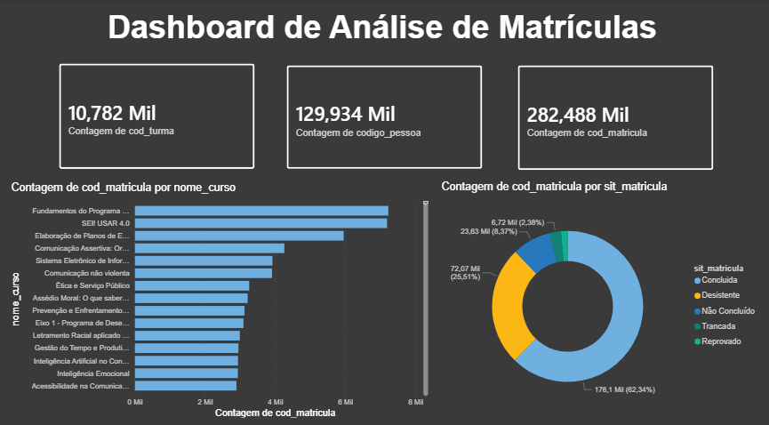

# Dashboard de Análise de Matrículas (EVG) - Modelagem Dimensional

## 📌 Descrição do Projeto
Este projeto consiste na estruturação, modelagem e visualização de dados de matrículas da plataforma EVG. A base original continha dados brutos e desorganizados em uma única tabela (tabela flat). Foi realizado um processo completo de ETL e modelagem dimensional utilizando o Power Query e o Power BI para transformar esses dados em um dashboard gerencial estratégico.

---

## 🛠️ Etapas do Desenvolvimento

### 1. Limpeza e Transformação de Dados (ETL)
* **Correção de Tipos:** Ajuste das colunas de texto, números inteiros e tratamento do campo de telefone (convertido para texto para evitar notação científica).
* **Tratamento de Nulos/Vazios:** Remoção de registros vazios nas chaves primárias para garantir a integridade referencial do modelo.
* **Remoção de Duplicadas:** Aplicação da regra de unicidade de chaves nas tabelas de dimensões.

### 2. Modelagem Dimensional (Star Schema)
A estrutura foi dividida seguindo o modelo Estrela (Star Schema), facilitando a performance das consultas e a criação dos relacionamentos:
* **Fato_Matriculas:** Tabela central contendo as chaves (`cod_matricula`, `cod_curso`, `cod_turma`, `codigo_pessoa`) e os fatos (`dt_matricula`, `sit_matricula`).
* **Dim_Cursos:** Dados descritivos sobre os cursos (nome, carga horária, temática, conteudista).
* **Dim_Turmas:** Informações sobre as turmas (nome, modalidade, status, data de término).
* **Dim_Alunos:** Perfil sociodemográfico e de contato dos alunos (sexo, idade, UF, município, instituição, poder, esfera).

> **Direção dos Filtros:** Todos os relacionamentos foram configurados com cardinalidade **1 para muitos (1:*)** e direção de filtro **Único**, propagando-se estritamente das dimensões para a fato.

---

## 📊 Indicadores Principais do Dashboard

* **Total de Matrículas:** 282.488 Mil
* **Alunos Únicos Atendidos:** 129.934 Mil
* **Cursos Ofertados:** 10.782 Mil

### Visuais Utilizados:
1. **Gráfico de Barras Empilhadas:** Ranking dos cursos com maior volume de matrículas.
2. **Gráfico de Rosca:** Distribuição percentual do status de situação das matrículas (Concluídos, Em Andamento, Desistentes).

---

## 🚀 Tecnologias Utilizadas
* **Power Query** (Extração e Tratamento)
* **Power BI** (Modelagem e Visualização)
* **DrawDB** (Planejamento do Modelo Lógico)

  

